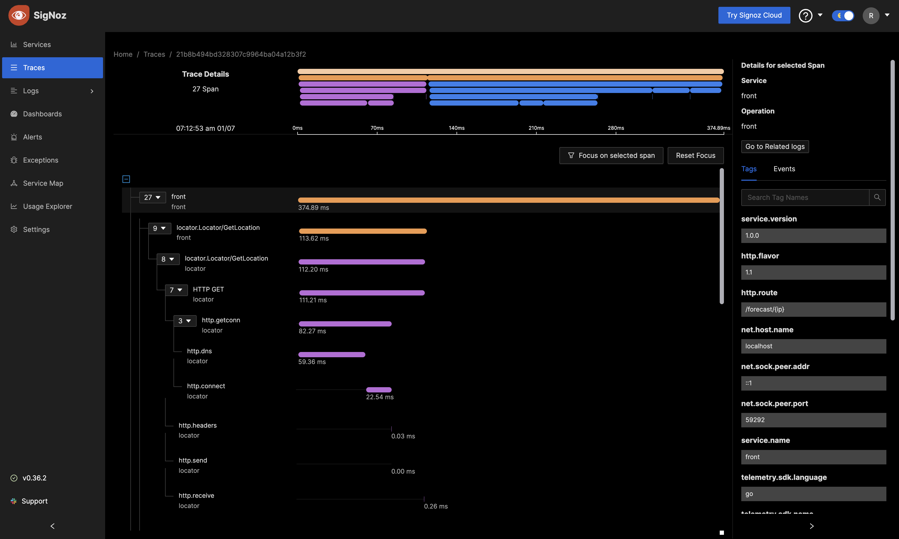

# Weather: An Example of a Fully Instrumented System

The `weather` example is a fully instrumented system that is composed of three
services:

* The `location` service makes requests to the `ip-api.com` web API to retrieve
  IP location information.
* The `forecaster` service makes requests to the `weather.gov` web API to retrieve
  weather forecast information.
* The `front` service exposes a public HTTP API that returns weather forecast
  information for a given IP. It makes requests to the `location` service
  followed by the `forecaster` service to collect the information.


## Running the Example

The following should get you going:

```bash
scripts/setup
scripts/server
```

`scripts/setup` configures all the required dependencies and compiles the services.
`scripts/server` runs the services using
[overmind](https://github.com/DarthSim/overmind). `scripts/server` also starts
`docker-compose` with a configuration that runs a self-hosted deployment of
[SigNoz](https://signoz.io/) as backend for instrumentation.

### Making a Request

Assuming you have a running weather system, you can make a request to the front
service using the `curl` command:

```bash
curl http://localhost:8084/forecast/8.8.8.8
```

If this returns successfully start the script that generates load:

```bash
scripts/load
```

### Looking at Telemetry Data

To analyze traces open the SigNoz dashboard running on
[http://localhost:3301](http://localhost:3301).



## Instrumentation

### Logging

The three services make use of the
[log](https://github.com/goadesign/clue/tree/main/log) package initialized in
`main`:

```go
ctx := log.Context(context.Background(), log.WithFormat(format), log.WithFunc(log.Span))
```

The `log.WithFormat` option enables colors when logging to a terminal while the
`log.Span` option adds the trace and span IDs to each log entry.

The `front` service uses the HTTP middleware to initialize the log context for
for every request:

```go
handler = log.HTTP(ctx)(handler)
```

The health check HTTP endpoints also use the log HTTP middleware to log errors:

```go
check = log.HTTP(ctx)(check).(http.HandlerFunc)
```

The gRPC services (`locator` and `forecaster`) use the gRPC interceptor returned by
`log.UnaryServerInterceptor` to initialize the log context for every request:

```go
grpcsvr := grpc.NewServer(
    grpc.ChainUnaryInterceptor(
        log.UnaryServerInterceptor(ctx), // <--
        debug.UnaryServerInterceptor()), 
    grpc.StatsHandler(otelgrpc.NewServerHandler())) 
```

### Instrumentation

The example runs a self-hosted deployment of [SigNoz](https://signoz.io/) as backend for instrumentation. Each service sends telemetry data to the OpenTelemetry collector running in the `docker-compose` configuration. The collector then forwards the data to the SigNoz backend.

```go
spanExporter, err := otlptracegrpc.New(ctx,
    otlptracegrpc.WithEndpoint(*oteladdr),
    otlptracegrpc.WithTLSCredentials(insecure.NewCredentials()))
if err != nil {
    log.Fatalf(ctx, err, "failed to initialize tracing")
}
defer func() {
    if err := spanExporter.Shutdown(ctx); err != nil {
        log.Errorf(ctx, err, "failed to shutdown tracing")
    }
}()
metricExporter, err := otlpmetricgrpc.New(ctx,
    otlpmetricgrpc.WithEndpoint(*oteladdr),
    otlpmetricgrpc.WithTLSCredentials(insecure.NewCredentials()))
if err != nil {
    log.Fatalf(ctx, err, "failed to initialize metrics")
}
defer func() {
    if err := metricExporter.Shutdown(ctx); err != nil {
        log.Errorf(ctx, err, "failed to shutdown metrics")
    }
}()
cfg, err := clue.NewConfig(
    genforecaster.ServiceName,
    genforecaster.APIVersion,
    metricExporter,
    spanExporter,
)
if err != nil {
    log.Fatalf(ctx, err, "failed to initialize instrumentation")
}
clue.ConfigureOpenTelemetry(ctx, cfg)
```

HTTP dependency clients use the `trace.Client` middleware to create spans for
each outgoing request:

```go
c := &http.Client{Transport: trace.Client(ctx, http.DefaultTransport)}
```

gRPC dependency clients use the `trace.UnaryClientInterceptor` interceptor to
create spans for each outgoing request:

```go
lcc, err := grpc.DialContext(ctx, *locatorAddr,
        grpc.WithTransportCredentials(insecure.NewCredentials()),
        grpc.WithUnaryInterceptor(trace.UnaryClientInterceptor(ctx)))
```

### Health Checks

Health checks are implemented using the `health` package, for example:

```go
check := health.Handler(health.NewChecker(wc))
```

The front service also uses the `health.NewPinger` function to create a health
checker for the `forecaster` and `location` services which both expose a
`/livez` HTTP endpoint:

```go
check := health.Handler(health.NewChecker(
        health.NewPinger("locator", "http", *locatorHealthAddr),
        health.NewPinger("forecaster", "http", *forecasterHealthAddr)))
```

The health check and metric handlers are mounted on a separate HTTP handler (the
global `http` standard library handler) to avoid logging, tracing and otherwise
instrumenting the corresponding requests.

```go
http.Handle("/livez", check)
http.Handle("/metrics", instrument.Handler(ctx))
```

The service HTTP handler created by Goa - if any - is mounted onto the global
handler under the root path so that all HTTP requests other than heath checks
and metrics are passed to it:

```go
http.Handle("/", handler)
```

### Client Mocks

The `front` service define clients for both the `locator` and `forecaster`
services under the `clients` directory. Each client is defined via a
`Client` interface, for example:

```go
// Client is a client for the forecast service.
Client interface {
        // GetForecast gets the forecast for the given location.
        GetForecast(ctx context.Context, lat, long float64) (*Forecast, error)
}
```

The interface is implemented by both a real and a mock client. The real client
is instantiated via the `New` function in the `client.go` file:

```go
// New instantiates a new forecast service client.
func New(cc *grpc.ClientConn) Client {
        c := genclient.NewClient(cc, grpc.WaitForReady(true))
        return &client{c.Forecast()}
}
```

The mock is instantiated via the `NewClient` function located in the
`mocks/client.go` file that is generated using the `cmg` tool:

```go
// NewMock returns a new mock client.
func NewClient(t *testing.T) *Client {
        var (
                m                     = &Client{mock.New(), t}
                _ = forecaster.Client = m
        )
        return m
}
```

The mock implementations make use of the `mock` package to make it possible to
create call sequences and validate them:

```go
type (
        // Mock implementation of the forecast client.
        Client struct {
                m *mock.Mock
                t *testing.T
        }

        ClientGetForecastFunc func(ctx context.Context, lat, long float64) (*forecaster.Forecast, error)
)
```

```go
// AddGetForecastFunc adds f to the mocked call sequence.
func (m *Client) AddGetForecast(f ClientGetForecastFunc) {
        m.m.Add("GetForecast", f)
}

// SetGetForecastFunc sets f for all calls to the mocked method.
func (m *Client) SetGetForecast(f ClientGetForecastFunc) {
        m.m.Set("GetForecast", f)
}

// GetForecast implements the Client interface.
func (m *Client) GetForecast(ctx context.Context, lat, long float64) (*forecaster.Forecast, error) {
        if f := m.m.Next("GetForecast"); f != nil {
                return f.(ClientGetForecastFunc)(ctx, lat, long)
        }
        m.t.Helper()
        m.t.Error("unexpected GetForecast call")
        return nil, nil
}
```

Tests leverage the `AddGetForecast` and `SetGetForecast` methods to configure
the mock client:

```go
lmock := mocklocator.NewClient(t)
lmock.AddGetLocation(c.locationFunc) // Mock the locator service.
fmock := mockforecaster.NewClient(t)
fmock.AddGetForecast(c.forecastFunc) // Mock the forecast service.
s := New(fmock, lmock) // Create front service instance for testing
```

The `mock` package is also used to create mocks for web services (`ip-api.com`
and `weather.gov`) in the `location` and `forecaster` services.

## Bug

A bug was intentionally left in the code to demonstrate how useful
instrumentation can be, can you find it? If you do let us know on
the Gophers slack [Goa channel](https://gophers.slack.com/messages/goa/)!
