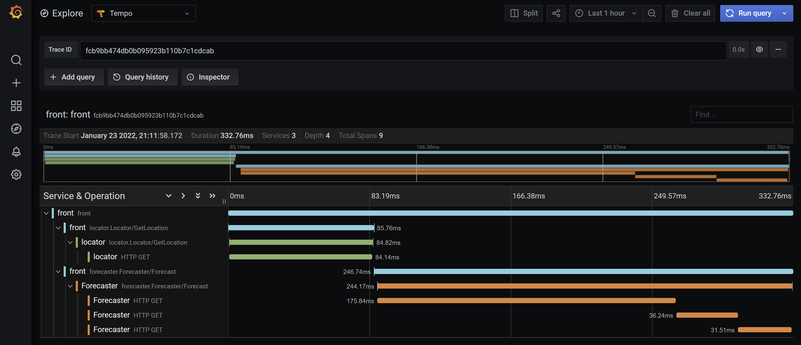

# Weather: An Example of a Fully Instrumented System

The `weather` example is a fully instrumented system that is composed of three
services:

* The `location` service makes requests to the `ip-api.com` web API to retrieve
  IP location information.
* The `forecast` service makes requests to the `weather.gov` web API to retrieve
  weather forecast information.
* The `front` service exposes a public HTTP API that returns weather forecast
  information for a given IP. It makes requests to the `location` service
  followed by the `forecast` service to collect the information.


## Running the Example

The following should get you going:

```bash
scripts/setup
scripts/server
```

`scripts/setup` download build dependencies and compiles the services.
`scripts/server` runs the services using
[overmind](https://github.com/DarthSim/overmind). `scripts/server` also starts
`docker-compose` with a configuration that runs the Grafana agent, cortex, tempo
and dashboard locally.

### Making a Request

Assuming you have a running weather system, you can make a request to the front
service using the `curl` command:

```bash
curl http://localhost:8084/forecast/8.8.8.8
```

### Looking at Traces

To analyze traces:

* Retrieve the front service trace ID from its logs, for example:

```
front      | DEBG[0003] svc=front requestID=aZtVOM7L traceID=fcb9bb474db0b095923b110b7c1cdcab
```

* Open the Grafana dashboard running on
  [http://localhost:3000](http://localhost:3000), click on `Explore` in the left
  pane and select `Tempo` in the top dropdown. Enter the trace ID and voila:



## Instrumentation

### Logging

The three services make use of the
[log](https://github.com/crossnokaye/micro/tree/main/log) package. The package
is initialized with the key / value pair `svc`:`<name of service>`, for example:

```go
ctx := log.With(log.Context(context.Background()), "svc", genfront.ServiceName)
```

The `front` service uses the HTTP middleware to initialize the log context for
for every request:

```go
handler = log.HTTP(ctx)(handler)
```

The health check HTTP endpoints also use the log HTTP middleware to log errors:

```go
check := log.HTTP(ctx)(health.Handler(health.NewChecker(location, forecast)))
```

The gRPC services (`locator` and `forecast`) use the gRPC intercetor returned by
`log.UnaryServerInterceptor` to initialize the log context for every request:

```go
grpcsvr := grpc.NewServer(
	grpcmiddleware.WithUnaryServerChain(
		goagrpcmiddleware.UnaryRequestID(),
		log.UnaryServerInterceptor(ctx),
		goagrpcmiddleware.UnaryServerLog(log.Adapt(ctx)),
		instrument.UnaryServerInterceptor(ctx, genforecast.ServiceName),
		trace.UnaryServerInterceptor(ctx),
	))
```

### Tracing

The example runs an [OpenTelemetry](https://opentelemetry.io/) collector that is
configured to listen to gRPC requests.  The collector is run in docker using an
official image and the configuration file `config/otel-local-config.yaml`.

Each service uses the
[trace](https://github.com/crossnokaye/micro/tree/main/trace) package to ship
traces to the collector:

```go
conn, err := grpc.DialContext(ctx, *collectorAddr,
	grpc.WithTransportCredentials(insecure.NewCredentials()),
	grpc.WithBlock())
ctx, err = trace.Context(ctx, genfront.ServiceName, conn)
```

gRPC services use the `trace.UnaryServerInterceptor` to create a span for each
request:

```go
grpcsvr := grpc.NewServer(
	grpcmiddleware.WithUnaryServerChain(
		goagrpcmiddleware.UnaryRequestID(),
		goagrpcmiddleware.UnaryServerLog(log.Adapt(ctx)),
		trace.UnaryServerInterceptor(ctx),
		instrument.UnaryServerInterceptor(ctx, genlocator.ServiceName),
	))
```

The front service uses the `trace.HTTP` middleware to create a span for each
request:

```go
handler = trace.HTTP(ctx, genfront.ServiceName)(handler)
```

HTTP dependency clients use the `trace.Client` middleware to create spans for
each outgoing request:

```go
c := &http.Client{Transport: trace.Client(ctx, http.DefaultTransport)}
```

gRPC dependency clients use the `trace.UnaryClientInterceptor` interceptor to
create spans for each outgoing request:

```go
lcc, err := grpc.DialContext(ctx, *locatorAddr,
	grpc.WithTransportCredentials(insecure.NewCredentials()),
	grpc.WithUnaryInterceptor(trace.UnaryClientInterceptor(ctx)))
```

### Metrics

The gRPC services are instrumented with the `instrument.UnaryServerInterceptor` interceptor:

```go
grpcsvr := grpc.NewServer(
	grpcmiddleware.WithUnaryServerChain(
		goagrpcmiddleware.UnaryRequestID(),
		goagrpcmiddleware.UnaryServerLog(log.Adapt(ctx)),
		trace.UnaryServerInterceptor(ctx),
		instrument.UnaryServerInterceptor(ctx, genlocator.ServiceName),
	))
```

The front service is instrumented with the `instrument.HTTP` middleware:

```go
handler = instrument.HTTP(genfront.ServiceName)(handler)
```

All the services run a HTTP server that exposes a Prometheus metrics endpoint at
`/metrics`. gRPC services use the default `http` mux:

```go
http.Handle("/metrics", instrument.Handler(ctx))
```

While the front service mounts the `/metrics` endpoint onto the already
configured Goa mux:

```go
mux.Handle("GET", "/metrics", instrument.Handler(ctx).(http.HandlerFunc))
```

### Health Checks

Health checks are implemented using the `health` package, for example:

```go
check := log.HTTP(ctx)(health.Handler(health.NewChecker(wc)))
```

The front service also uses the `health.NewPinger` function to create a health
checker for the `forecast` and `location` services which both expose a `/livez`
HTTP endpoint:

```go
check := health.Handler(health.NewChecker(
	health.NewPinger("locator", "http", *locatorHealthAddr),
	health.NewPinger("forecast", "http", *forecastHealthAddr)))
```

The health check handler is wrapped with the log HTTP middleware so that errors
may be logged:

```go
check = log.HTTP(ctx)(check).(http.HandlerFunc)
```

The health check handler is mounted on the Goa mux or on the native `http` mux
if the service uses gRPC (and thus does not use the Goa mux):

```go
mux.Handle("GET", "/livez", check)
```

```go
http.Handle("/livez", check)
```

### Client Mocks

The `front` service define clients for both the `locator` and `forecast`
services under the `clients` directory. Each client is defined via a
`Client` interface, for example:

```go
// Client is a client for the forecast service.
Client interface {
	// GetForecast gets the forecast for the given location.
	GetForecast(ctx context.Context, lat, long float64) (*Forecast, error)
}
```

The interface is implemented by both a real and a mock client. The real client
is instantiated via the `New` function in the `client.go` file:

```go
// New instantiates a new forecast service client.
func New(cc *grpc.ClientConn) Client {
	c := genclient.NewClient(cc, grpc.WaitForReady(true))
	return &client{c.Forecast()}
}
```

The mock is instantiated via the `NewMock` function located in the `mock.go` file:

```go
var _ Client = &Mock{}

// NewMock returns a new mock client.
func NewMock(t *testing.T) *Mock {
	return &Mock{mock.New(), t}
}
```

The mock implementations make use of the `mock` package to make it possible to
create call sequences and validate them:

```go
type (
       	// Mock implementation of the forecast client.
	Mock struct {
		m *mock.Mock
		t *testing.T
	}
)
```

```go
// AddGetForecastFunc adds f to the mocked call sequence.
func (m *Mock) AddGetForecastFunc(f GetForecastFunc) {
	m.m.Add("GetForecast", f)
}

// SetGetForecastFunc sets f for all calls to the mocked method.
func (m *Mock) SetGetForecastFunc(f GetForecastFunc) {
	m.m.Set("GetForecast", f)
}

// GetForecast implements the Client interface.
func (m *Mock) GetForecast(ctx context.Context, lat, long float64) (*Forecast, error) {
	if f := m.m.Next("GetForecast"); f != nil {
		return f.(GetForecastFunc)(ctx, lat, long)
	}
	m.t.Error("unexpected call to GetForecast")
	return nil, nil
}
```

Tests leverage the `AddGetForecastFunc` and `SetGetForecastFunc` methods to
configure the mock client:

```go
lmock := locator.NewMock(t)
lmock.AddGetLocationFunc(c.locationFunc) // Mock the locator service.
fmock := forecast.NewMock(t)
fmock.AddGetForecastFunc(c.forecastFunc) // Mock the forecast service.
s := New(fmock, lmock) // Create front service instance for testing
```

The `mock` package is also used to create mocks for web services (`ip-api.com`
and `weather.gov`) in the `location` and `forecast` services.

## Bug

A bug was intentionally left in the code to demonstrate how useful
instrumentation can be, can you find it? If you do, let me know and I'll buy you
a drink.